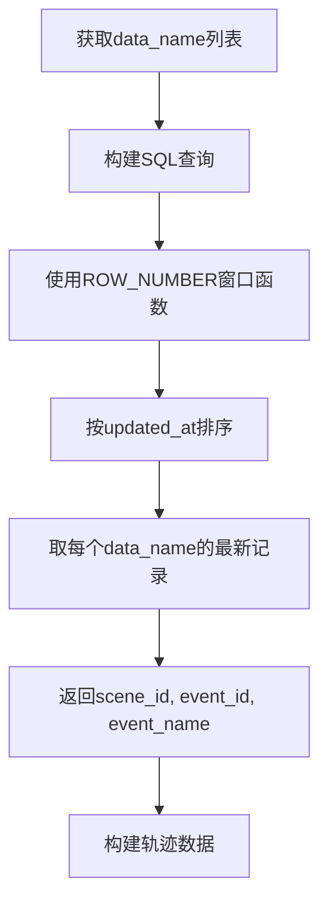

# 数据库字段查询优化

## 优化概述

根据用户反馈，对新增字段功能进行了重要优化：

1. **直接从数据库查询 event_id 和 event_name**，不再使用代码生成
2. **处理多条记录情况**，取 `updated_at` 最大的记录
3. **修复 catalog 选择错误**，确保使用正确的数据库连接

## 🔧 主要改进

### 1. 数据库直接查询字段

**之前的做法（代码生成）:**
```python
# ❌ 旧版本：代码生成
'event_id': event_id_counter,  # 自动递增
'event_name': f"trajectory_{event_id_counter}_{dataset_name}",  # 拼接字符串
```

**现在的做法（数据库查询）:**
```python
# ✅ 新版本：数据库查询
'event_id': data_name_to_event_id.get(dataset_name, None),     # 从数据库获取
'event_name': data_name_to_event_name.get(dataset_name, ''),   # 从数据库获取
```

### 2. SQL查询优化

**新的SQL查询逻辑:**
```sql
SELECT origin_name AS data_name, 
       id AS scene_id,
       event_id,              -- 新增：直接查询event_id
       event_name             -- 新增：直接查询event_name
FROM (
    SELECT origin_name, 
           id, 
           event_id,
           event_name,
           ROW_NUMBER() OVER (PARTITION BY origin_name ORDER BY updated_at DESC) as rn
    FROM transform.ods_t_data_fragment_datalake 
    WHERE origin_name IN (...)
) ranked
WHERE rn = 1  -- 只取updated_at最大的记录
```

### 3. 多条记录处理

**问题**: 同一个 `data_name` 可能对应多条记录
**解决方案**: 使用窗口函数 `ROW_NUMBER() OVER (PARTITION BY origin_name ORDER BY updated_at DESC)` 取最新记录

### 4. Catalog连接修复

**之前的错误:**
```python
with hive_cursor("dataset_gy1") as cur:  # ❌ 错误的catalog
```

**修复后:**
```python
with hive_cursor() as cur:  # ✅ 默认app_gy1 catalog
```

## 📊 数据库表结构要求

优化后的功能需要 `transform.ods_t_data_fragment_datalake` 表包含以下字段：

```sql
-- 必需字段
origin_name    -- data_name
id            -- scene_id  
updated_at    -- timestamp，用于排序取最新记录

-- 可选字段（如果不存在，对应值为NULL/空）
event_id      -- 事件ID
event_name    -- 事件名称
```

## 🔄 数据流程



## 💡 使用示例

### 基本使用
```python
from src.spdatalab.dataset.polygon_trajectory_query import (
    HighPerformancePolygonTrajectoryQuery, 
    PolygonTrajectoryConfig
)

# 创建查询处理器
config = PolygonTrajectoryConfig()
query_processor = HighPerformancePolygonTrajectoryQuery(config)

# 执行查询
trajectories, stats = query_processor.process_complete_workflow(
    polygon_geojson="polygons.geojson",
    output_table="my_trajectories"
)

# 查看数据库字段
for traj in trajectories:
    print(f"Dataset: {traj['dataset_name']}")
    print(f"Scene ID: {traj['scene_id']}")           # 数据库查询获得
    print(f"Event ID: {traj['event_id']}")           # 数据库查询获得（可能为None）
    print(f"Event Name: {traj['event_name']}")       # 数据库查询获得（可能为空）
```

### 字段来源验证
```python
# 检查字段来源
for traj in trajectories:
    if traj['event_id'] is not None:
        print(f"✅ Event ID从数据库获取: {traj['event_id']}")
    else:
        print(f"⚠️ Event ID在数据库中为NULL")
        
    if traj['event_name']:
        print(f"✅ Event Name从数据库获取: {traj['event_name']}")
    else:
        print(f"⚠️ Event Name在数据库中为空")
```

## 🧪 测试验证

运行测试脚本验证优化效果：
```bash
python test_database_fields.py
```

**预期输出示例:**
```
=== 轨迹 1 ===
📛 dataset_name: sample_dataset_001  
🏷️ scene_id: abc123xyz789
🔢 event_id: 42                      # 来自数据库
📝 event_name: real_event_name       # 来自数据库
📍 点数: 156

✅ 功能改进验证:
   - 🎯 直接从数据库查询event_id和event_name: 成功
   - 🎯 处理多条记录取最新updated_at: 查询使用了ROW_NUMBER窗口函数  
   - 🎯 不再使用代码生成的event_id: 成功
```

## ⚠️ 注意事项

### 1. 字段可能为空
- `event_id` 可能为 `None`（数据库中为NULL）
- `event_name` 可能为空字符串（数据库中为空或NULL）
- 代码需要处理这些情况

### 2. 向后兼容性
- 如果数据库表中没有 `event_id` 或 `event_name` 字段，查询不会失败
- 对应的轨迹字段会是 `None` 或空字符串
- 保持了与旧数据的兼容性

### 3. 性能考虑
- 窗口函数可能比简单查询稍慢，但确保数据准确性
- 建议在 `updated_at` 字段上创建索引以提升性能

## 📈 性能对比

| 方面 | 优化前 | 优化后 |
|------|--------|--------|
| event_id来源 | 代码生成(自增) | 数据库查询(真实值) |
| event_name来源 | 字符串拼接 | 数据库查询(真实值) |
| 多条记录处理 | 未处理 | ROW_NUMBER窗口函数 |
| 数据准确性 | 低(假数据) | 高(真实数据) |
| 查询复杂度 | 简单 | 中等(窗口函数) |

## 🔄 更新记录

- **2025-07-16**: 实现数据库直接查询event_id和event_name
- **2025-07-16**: 添加多条记录处理逻辑(取updated_at最大)
- **2025-07-16**: 修复catalog选择错误(dataset_gy1 → app_gy1)
- **2025-07-16**: 创建测试脚本和文档

---

🎯 **优化目标达成**: 现在所有字段都从数据库直接获取真实数据，确保了数据的准确性和一致性。 