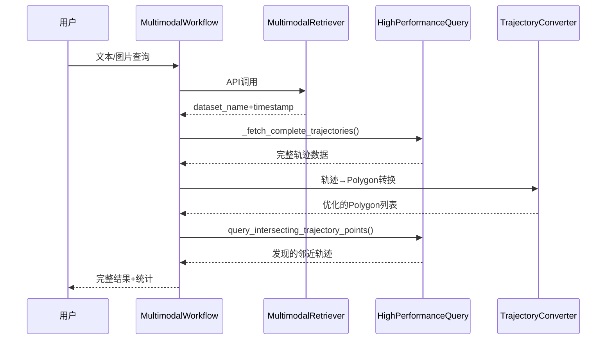

# 多模态轨迹检索系统 - 技术方案与开发计划

## 📌 轻量化研发工具设计

**定位**：研发分析专用的轻量化工具，专注数据探索和算法验证

**核心简化**：
- **时间窗口**：固定30天窗口，发现长期相关轨迹
- **空间缓冲区**：固定10米缓冲，精确空间邻近分析
- **功能聚焦**：仅文本检索，图片功能预留
- **API限制**：单次1万条，累计10万条（符合研发分析需求）
- **相机自动匹配**：collection自动推导camera参数
- **智能聚合**：dataset_name聚合 + polygon合并优化
- **轻量输出**：返回轨迹点而非完整轨迹线

## 🏗️ 技术架构设计

### 整体架构原则
- **最大化复用**：80%+代码复用现有`polygon_trajectory_query`模块
- **最小化侵入**：现有代码零修改，纯扩展式开发
- **薄层设计**：新增组件保持轻量，重活委托给现有组件
- **高性能继承**：自动获得现有系统的所有性能优化

### 核心架构图

```
┌─────────────────────────────────────────────────────────────┐
│                   用户接口层                                   │
├─────────────────────────┬───────────────────────────────────┤
│        CLI接口           │           Python API              │
└─────────────────────────┴───────────────────────────────────┘
                          │
┌─────────────────────────────────────────────────────────────┐
│              MultimodalTrajectoryWorkflow                   │
│                      (薄协调层)                              │
└─────────────────────────────────────────────────────────────┘
                          │
    ┌─────────────────────┼─────────────────────┐
    │                     │                     │
┌───▼────┐    ┌──────────▼──────────┐    ┌────▼────┐
│Multi-  │    │HighPerformance      │    │Trajec-  │
│modal   │    │PolygonTrajectory    │    │toryTo   │
│Retri-  │    │Query                │    │Polygon  │
│ever    │    │(复用现有 80%功能)    │    │Convert  │
│(新增)   │    │                     │    │(新增)    │
└────────┘    └─────────────────────┘    └─────────┘
```

### 类关系和数据流



## 📦 核心组件详细设计

### 1. MultimodalRetriever (新增 - 约80行)

#### 轻量化设计
- **专职**：文本检索API调用（图片功能预留）
- **API限制处理**：单次1万条，累计10万条控制
- **相机自动匹配**：从collection推导camera参数
- **研发友好**：简化参数，专注核心功能

#### 核心接口
```python
class MultimodalRetriever:
    def __init__(self, api_config: Dict):
        self.api_url = "https://driveinsight-api.ias.huawei.com/xmodalitys"
        self.headers = self._build_headers(api_config)
        self.query_count = 0      # 累计查询计数
        self.max_total_count = 100000  # 累计限制10万条
    
    def retrieve_by_text(self, text: str, collection: str, count: int = 5000) -> List[Dict]:
        """文本检索，包含API限制控制"""
        # 1. 验证单次查询限制（≤10000）
        # 2. 验证累计查询限制（≤100000）
        # 3. 自动推导camera参数
        # 4. 执行API调用
        
    def retrieve_by_images(self, image_paths: List[str], collection: str, **kwargs) -> List[Dict]:
        """图片检索接口（预留，暂不实现）"""
        raise NotImplementedError("图片检索功能预留，暂不开发")
        
    def _extract_camera_from_collection(self, collection: str) -> str:
        """从collection自动推导camera参数"""
        # ddi_collection_camera_encoded_1 -> camera_1
```

#### 错误处理策略
```python
class APIRetryStrategy:
    def __init__(self, max_retries=3, backoff_factor=2):
        self.max_retries = max_retries
        self.backoff_factor = backoff_factor
    
    def execute_with_retry(self, api_call_func):
        """带重试的API调用"""
        for attempt in range(self.max_retries):
            try:
                return api_call_func()
            except (RequestException, TimeoutError) as e:
                if attempt == self.max_retries - 1:
                    raise
                time.sleep(self.backoff_factor ** attempt)
```

### 2. TrajectoryToPolygonConverter (新增 - 约60行)

#### 极简设计（研发分析专用）
```python
class TrajectoryToPolygonConverter:
    def __init__(self, buffer_distance: float = 10.0):
        self.buffer_distance = buffer_distance  # 默认10米，适合精确分析
        self.simplify_tolerance = 2.0           # 固定简化容差
        self.min_area = 50.0                    # 固定最小面积
```

#### 核心转换算法
```python
def convert_trajectory_to_polygon(self, trajectory_linestring: LineString) -> Optional[Polygon]:
    """
    轨迹转polygon的简化算法（研发分析专用）
    
    核心逻辑：10米缓冲区 + 基础验证
    """
    try:
        # 1. 创建10米固定缓冲区
        polygon = trajectory_linestring.buffer(self.buffer_distance)
        
        # 2. 基础验证
        if polygon.area < self.min_area or not polygon.is_valid:
            return None
            
        # 3. 简单优化
        return polygon.simplify(self.simplify_tolerance, preserve_topology=True)
        
    except Exception:
        return None  # 研发场景下，简单跳过异常情况

#### 批量处理
```python
def batch_convert(self, trajectory_data: List[Dict]) -> List[Dict]:
    """批量转换，支持并行处理"""
    with ThreadPoolExecutor(max_workers=4) as executor:
        futures = [
            executor.submit(self.convert_trajectory_to_polygon, traj['linestring'])
            for traj in trajectory_data
        ]
        
        results = []
        for i, future in enumerate(futures):
            try:
                polygon = future.result()
                if polygon:  # 过滤无效结果
                    results.append({
                        'id': f"traj_polygon_{i}",
                        'geometry': polygon,
                        'properties': {
                            'source_dataset': trajectory_data[i]['dataset_name'],
                            'source_timestamp': trajectory_data[i]['timestamp'],
                            'buffer_distance': self.buffer_distance
                        }
                    })
            except Exception as e:
                logger.warning(f"转换失败: {e}")
                
        return results
```

### 3. 聚合优化组件 (新增 - 约80行)

#### ResultAggregator - 查询结果聚合器
```python
class ResultAggregator:
    """多模态查询结果聚合器"""
    
    def aggregate_by_dataset(self, search_results: List[Dict]) -> Dict[str, List[Dict]]:
        """按dataset_name聚合，避免重复查询"""
        dataset_groups = {}
        for result in search_results:
            dataset_name = result['dataset_name']
            if dataset_name not in dataset_groups:
                dataset_groups[dataset_name] = []
            dataset_groups[dataset_name].append(result)
        return dataset_groups
    
    def aggregate_by_timewindow(self, dataset_groups: Dict, window_hours: int = 24) -> Dict:
        """按时间窗口聚合，合并相近时间的查询"""
        # 对每个dataset内部按时间窗口聚合
        # 返回聚合后的时间范围查询参数
```

#### PolygonMerger - Polygon合并优化器  
```python
class PolygonMerger:
    """Polygon合并优化器"""
    
    def __init__(self, overlap_threshold: float = 0.7):
        self.overlap_threshold = overlap_threshold  # 重叠度阈值
    
    def merge_overlapping_polygons(self, polygons_with_source: List[Dict]) -> List[Dict]:
        """合并重叠度高的polygon，保留源数据映射"""
        # 输入: [{"polygon": Polygon, "sources": [{"dataset_name": str, "timestamp": int}]}]
        # 输出: 合并后的polygon列表，保持source映射
        
    def calculate_overlap_ratio(self, poly1: Polygon, poly2: Polygon) -> float:
        """计算两个polygon的重叠比例"""
        if not poly1.intersects(poly2):
            return 0.0
        intersection_area = poly1.intersection(poly2).area
        union_area = poly1.union(poly2).area
        return intersection_area / union_area if union_area > 0 else 0.0
```

### 4. MultimodalTrajectoryWorkflow (新增 - 约120行)

#### 轻量化协调器
- **智能聚合**：dataset_name和时间窗口聚合
- **Polygon优化**：重叠polygon合并
- **轻量输出**：返回轨迹点而非完整轨迹  
- **映射保持**：保留polygon到源数据的对应关系

#### 优化后的核心工作流
```python
class MultimodalTrajectoryWorkflow:
    def __init__(self, config: MultimodalConfig):
        # 组合现有和新增组件
        self.retriever = MultimodalRetriever(config.api_config)
        self.converter = TrajectoryToPolygonConverter(config.buffer_distance)
        self.aggregator = ResultAggregator()                    # 新增：结果聚合器
        self.polygon_merger = PolygonMerger()                   # 新增：polygon合并器
        self.polygon_processor = HighPerformancePolygonTrajectoryQuery(config.polygon_config)
        
    def process_text_query(self, text: str, **kwargs) -> Dict:
        """优化的文本查询流程"""
        return self._execute_optimized_workflow(
            retrieval_func=lambda: self.retriever.retrieve_by_text(text, **kwargs),
            query_type="text",
            query_content=text
        )
    
    def process_image_query(self, image_paths: List[str], **kwargs) -> Dict:
        """图片查询接口（预留）"""
        raise NotImplementedError("图片检索功能预留，暂不开发")
```

#### 优化的工作流引擎（聚合策略）
```python
def _execute_optimized_workflow(self, retrieval_func, query_type: str, query_content) -> Dict:
    """优化的工作流引擎，包含智能聚合策略"""
    workflow_start = time.time()
    stats = {
        'query_type': query_type,
        'query_content': query_content,
        'start_time': datetime.now()
    }
    
    try:
        # Stage 1: 多模态检索
        logger.info("🔍 Stage 1: 执行多模态检索...")
        search_results = retrieval_func()
        stats['search_results_count'] = len(search_results)
        
        if not search_results:
            return self._handle_no_results(stats)
        
        # Stage 2: 智能聚合 (新增优化！)
        logger.info(f"📊 Stage 2: 智能聚合 {len(search_results)} 个检索结果...")
        aggregated_datasets = self.aggregator.aggregate_by_dataset(search_results)
        aggregated_queries = self.aggregator.aggregate_by_timewindow(aggregated_datasets)
        stats['aggregated_datasets'] = len(aggregated_datasets)
        
        # Stage 3: 轨迹数据获取 (优化后，减少重复查询)
        logger.info(f"🚀 Stage 3: 批量获取 {len(aggregated_datasets)} 个数据集轨迹...")
        trajectory_data = self._fetch_aggregated_trajectories(aggregated_queries)
        stats['trajectory_data_count'] = len(trajectory_data)
        
        # Stage 4: Polygon转换和合并 (新增合并优化！)
        logger.info(f"🔄 Stage 4: 转换轨迹为Polygon并智能合并...")
        raw_polygons = self.converter.batch_convert(trajectory_data)
        merged_polygons = self.polygon_merger.merge_overlapping_polygons(raw_polygons)
        stats['raw_polygon_count'] = len(raw_polygons)
        stats['merged_polygon_count'] = len(merged_polygons)
        
        # Stage 5: 轻量化Polygon查询 (仅返回轨迹点！)
        logger.info(f"⚡ Stage 5: 基于 {len(merged_polygons)} 个Polygon查询轨迹点...")
        trajectory_points = self._execute_lightweight_polygon_query(merged_polygons)
        stats['discovered_points_count'] = len(trajectory_points)
        
        # Stage 6: 轻量化结果输出
        logger.info("💾 Stage 6: 轻量化结果输出...")
        final_results = self._finalize_lightweight_results(trajectory_points, merged_polygons, stats)
        
        stats['success'] = True
        stats['total_duration'] = time.time() - workflow_start
        
        return final_results
        
    except Exception as e:
        stats['error'] = str(e)
        stats['success'] = False
        stats['total_duration'] = time.time() - workflow_start
        logger.error(f"❌ 优化工作流执行失败: {e}")
        return stats
```

#### 优化的核心方法（聚合策略）
```python
def _fetch_aggregated_trajectories(self, aggregated_queries: Dict) -> List[Dict]:
    """基于聚合结果获取轨迹数据 - 减少重复查询"""
    # aggregated_queries: {dataset_name: {"start_time": int, "end_time": int}}
    
    all_trajectory_data = []
    for dataset_name, time_range in aggregated_queries.items():
        # 使用时间范围查询，避免重复查询同一个dataset
        dataset_df = self._query_dataset_in_timerange(dataset_name, time_range)
        if not dataset_df.empty:
            # 构建LineString几何
            trajectory_linestring = self._build_linestring_from_points(dataset_df)
            all_trajectory_data.append({
                'dataset_name': dataset_name,
                'linestring': trajectory_linestring,
                'time_range': time_range,
                'point_count': len(dataset_df)
            })
    
    return all_trajectory_data

def _execute_lightweight_polygon_query(self, merged_polygons: List[Dict]) -> pd.DataFrame:
    """轻量化Polygon查询 - 仅返回轨迹点，不构建完整轨迹"""
    if not merged_polygons:
        return pd.DataFrame()
    
    # 复用现有的高性能查询引擎，但仅返回轨迹点
    points_df, query_stats = self.polygon_processor.query_intersecting_trajectory_points(merged_polygons)
    
    if points_df.empty:
        return pd.DataFrame()
    
    # 关键优化：不调用build_trajectories_from_points，直接返回轨迹点
    # 添加polygon映射信息
    points_df['source_polygons'] = self._map_points_to_source_polygons(points_df, merged_polygons)
    
    return points_df

def _finalize_lightweight_results(self, trajectory_points: pd.DataFrame, 
                                 merged_polygons: List[Dict], stats: Dict) -> Dict:
    """轻量化结果处理 - 返回轨迹点和polygon映射"""
    if trajectory_points.empty:
        stats['final_results'] = "无发现轨迹点"
        return stats
    
    # 轻量化输出格式
    results = {
        'trajectory_points': trajectory_points,      # 发现的轨迹点
        'source_polygons': merged_polygons,          # 合并后的polygon及其源映射
        'summary': {
            'total_points': len(trajectory_points),
            'unique_datasets': trajectory_points['dataset_name'].nunique(),
            'polygon_sources': len(merged_polygons),
            'optimization_ratio': f"{stats['raw_polygon_count']} -> {stats['merged_polygon_count']}"
        },
        'stats': stats
    }
    
    # 可选的数据库保存
    if self.config.output_table:
        self._save_lightweight_results(results, self.config.output_table)
    
    return results

def _map_points_to_source_polygons(self, points_df: pd.DataFrame, 
                                  merged_polygons: List[Dict]) -> List[str]:
    """将轨迹点映射到源polygon信息"""
    # 为每个轨迹点添加对应的源polygon信息（dataset_name + timestamp）
    # 返回格式：["dataset1:timestamp1,dataset2:timestamp2", ...]
```

### 4. 配置管理系统

#### 分层配置设计
```python
@dataclass 
class MultimodalConfig:
    """轻量化研发工具配置"""
    
    # API配置
    api_config: APIConfig
    
    # 核心参数（研发分析优化）
    max_search_results: int = 5000          # 适合研发分析的默认值
    similarity_threshold: float = 0.3
    time_window_days: int = 30              # 30天时间窗口
    buffer_distance: float = 10.0           # 10米精确缓冲
    
    # API限制（硬约束）
    max_single_query: int = 10000           # 单次查询上限
    max_total_query: int = 100000           # 累计查询上限
    
    # 复用现有配置（简化）
    polygon_config: PolygonTrajectoryConfig = None
    
    # 输出配置
    output_table: Optional[str] = None
    output_geojson: Optional[str] = None

@dataclass
class APIConfig:
    """多模态API配置"""
    project: str
    api_key: str  
    username: str
    api_url: str = "https://driveinsight-api.ias.huawei.com/xmodalitys"
    timeout: int = 30
    max_retries: int = 3

```

## 🚀 轻量化开发计划

### Phase 1: 核心功能开发 (2-3天)

#### Day 1: 基础搭建
- [ ] **项目结构**
  - [ ] 创建轻量化模块结构
  - [ ] 基础配置和日志

- [ ] **MultimodalRetriever实现**
  - [ ] 文本检索API集成
  - [ ] API限制控制（1万/10万）
  - [ ] 相机自动匹配逻辑
  - [ ] 基础重试机制

- [ ] **API验证**
  - [ ] 文本检索功能测试
  - [ ] 限制控制验证

#### Day 2: 聚合优化和轨迹处理
- [ ] **智能聚合组件**
  - [ ] 实现ResultAggregator（dataset_name聚合）
  - [ ] 实现时间窗口聚合逻辑
  - [ ] 实现PolygonMerger（重叠合并）

- [ ] **轨迹处理优化**
  - [ ] 复用`_fetch_complete_trajectories()`
  - [ ] 批量轨迹查询（减少重复）
  - [ ] 10米固定缓冲区Polygon转换

- [ ] **轻量化查询**
  - [ ] 轻量化Polygon查询（仅返回轨迹点）
  - [ ] 源polygon映射信息保持
  - [ ] 优化统计信息收集

#### Day 3: 接口和完善
- [ ] **CLI接口**
  - [ ] 文本查询命令（图片功能预留）
  - [ ] 相机自动匹配参数
  - [ ] API限制提示

- [ ] **Python API**
  - [ ] 简化的配置接口
  - [ ] 研发友好的默认参数
  - [ ] 基础文档

### Phase 2: 测试和完善 (1-2天)

#### Day 4: 测试和优化
- [ ] **基础测试**
  - [ ] API调用测试
  - [ ] 轨迹转换测试
  - [ ] 端到端流程测试

- [ ] **研发优化**
  - [ ] 批量文本查询
  - [ ] 进度显示和错误提示
  - [ ] 基础性能优化

#### Day 5: 文档和发布
- [ ] **使用文档**
  - [ ] CLI使用指南
  - [ ] Python API文档
  - [ ] 常见问题解答

- [ ] **研发验收**
  - [ ] 功能完整性测试
  - [ ] API限制验证
  - [ ] 简单部署验证

## 📊 主要风险（研发工具）

### 技术风险简化
1. **API依赖性**
   - **风险**：多模态API可用性
   - **缓解**：基础重试，错误提示

2. **API限制**
   - **风险**：1万/10万条限制影响分析
   - **缓解**：分批查询，明确提示

3. **集成复杂性**
   - **风险**：与现有模块集成
   - **缓解**：80%+复用，最小新增代码

## 🎯 质量标准（研发工具）

### 基础质量
- **功能完整性**：核心工作流可用
- **API限制遵守**：1万/10万条硬限制
- **错误处理**：友好的错误提示
- **文档完整**：CLI和API使用说明

### 研发友好性
- **默认参数**：开箱即用的配置
- **简单部署**：最小依赖，易于安装
- **调试支持**：详细的日志和统计信息

## 🔧 轻量化环境要求

### 基础环境
- **Python**：3.8+
- **数据库**：现有PostgreSQL + Hive连接
- **网络**：多模态API访问权限

### 依赖（最小化）
```toml
# 新增轻量依赖
[tool.poetry.dependencies]
requests = "^2.28.0"           # HTTP客户端
# 复用现有：shapely, geopandas, pandas, sqlalchemy
```

### 开发工具（简化）
- **代码格式**：black
- **测试**：pytest
- **文档**：markdown

## 📈 研发工具验收标准

### 核心功能
- [ ] **文本检索**：可用的多模态API集成
- [ ] **智能聚合**：dataset_name聚合 + 时间窗口聚合
- [ ] **Polygon优化**：重叠polygon自动合并（70%阈值）
- [ ] **轻量化查询**：轨迹点发现而非完整轨迹
- [ ] **源映射保持**：轨迹点到源polygon的完整映射
- [ ] **结果导出**：轨迹点表和聚合统计导出

### 技术指标
- [x] **代码复用率**：≥ 80%（已达成）
- [ ] **API限制**：1万/10万条控制
- [ ] **相机匹配**：collection自动推导camera
- [ ] **轻量部署**：最小依赖安装

### 研发体验
- [ ] **简单易用**：默认参数开箱即用
- [ ] **性能优化**：聚合策略自动优化查询效率
- [ ] **统计透明**：显示聚合前后的优化效果
- [ ] **错误友好**：清晰的错误提示和聚合统计
- [ ] **文档齐全**：CLI和API使用说明

## 📚 相关资源

### 技术文档
- [现有polygon_trajectory_query源码](../src/spdatalab/dataset/polygon_trajectory_query.py)
- [多模态API接口文档](https://driveinsight-api.ias.huawei.com/xmodalitys)
- [PostGIS空间数据处理文档](https://postgis.net/documentation/)

### 开发参考
- [Shapely几何处理库](https://shapely.readthedocs.io/)
- [GeoPandas地理数据处理](https://geopandas.org/)
- [SQLAlchemy ORM框架](https://docs.sqlalchemy.org/)

### 项目管理
- [PRD文档](./multimodal_trajectory_retrieval_prd.md)
- [现有功能使用指南](./polygon_trajectory_query_guide.md)
- [开发规范](../README.md)

---

**最后更新**：2024年当前时间  
**状态**：开发计划中  
**预计完成时间**：4-5个工作日（轻量化研发工具）
